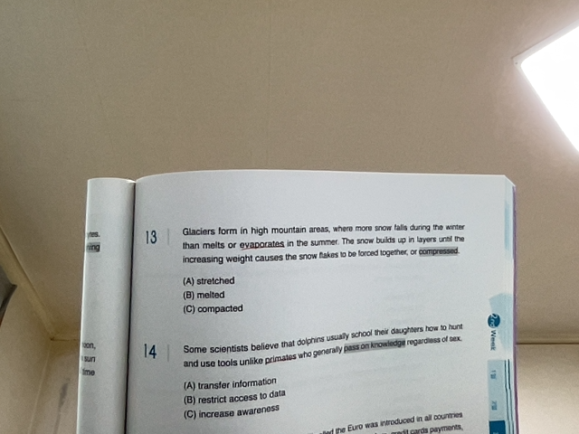

# OCR

text recognition with opencv js

## TODO

- merge boxes
- Rescaling
- Rotation / Deskewing
- crop

## 전처리

### 원본

### Grayscale

### Filtering out noise

### Binary

### Contours Detection

### Final Image with Bounding Boxes

